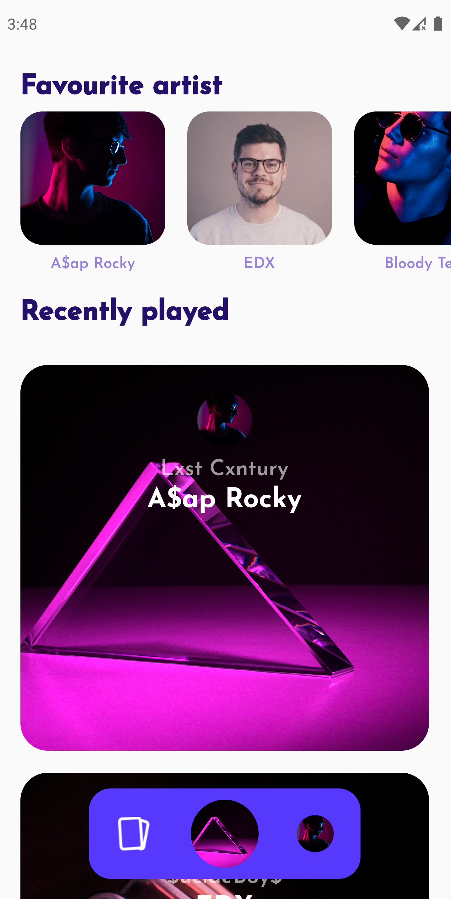
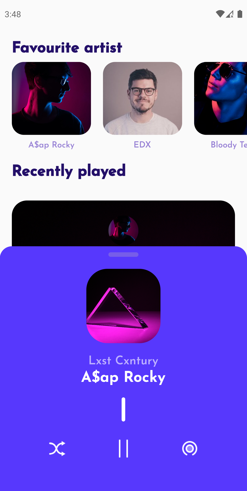

## **WIDGET CHALLENGE**
### Flutter Widget Challenge proposed by diegoveloper for the Flutter Spanish Comunity

## **NOTES**
```
flutter pub get
flutter run
```

###  Screens

<TABLE BORDER>
    <TR>
        <TH style="text-align:center">NAVBAR CLOSE</TH>
        <TH style="text-align:center">NAVBAR OPEN</TH>
    </TR>
	<TR>
		<TD></TD>  
		<TD></TD>  
	</TR>
</TABLE>